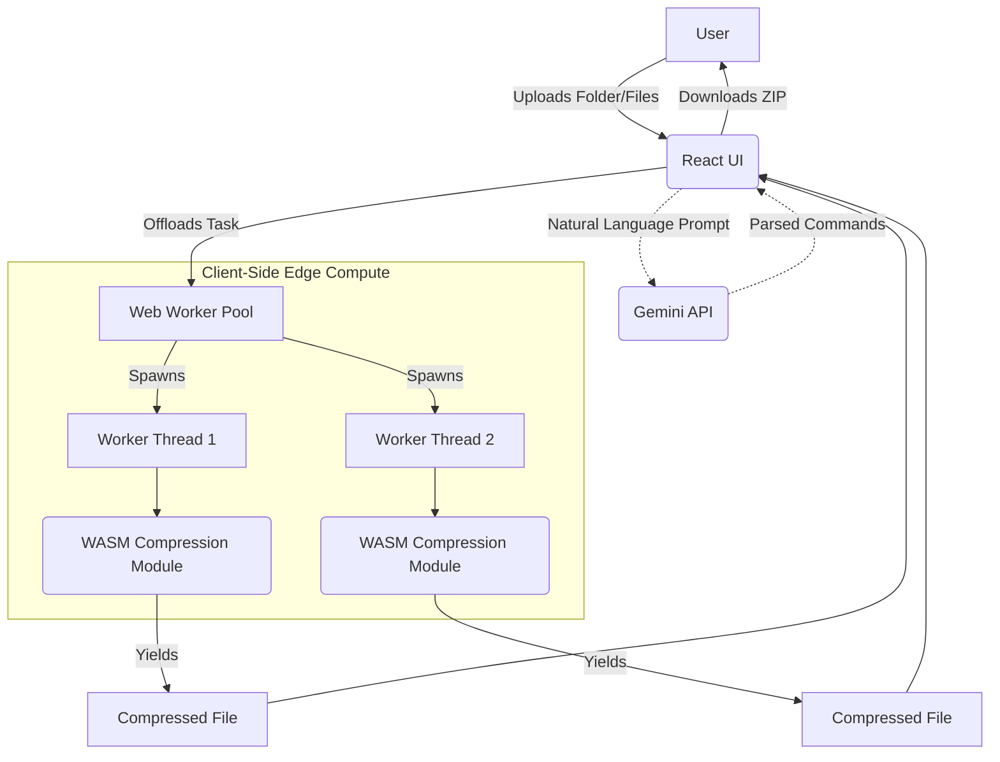

<div align="center">

# 📦 PerfectByte
### Local-First File Compression & AI Assistant

<a href="https://perfectbyte.vercel.app">
  
</a>
<a href="https://github.com/dheerajeshwar32/PerfectByte">
  
</a>

PerfectByte is a privacy-first, client-side web application engineered to perform aggressive file compression and manipulation entirely within the browser. By leveraging **Web Workers** and a **zero-server architecture**, PerfectByte ensures user data never leaves the device.

</div>

---

## ⚡ Live Demo

*(Replace `public/demo.gif` with a screen recording of the app in action!)*

## 🧠 System Architecture

PerfectByte avoids traditional backend API bottlenecks. All file I/O, rasterization, and compression algorithms execute locally on the client's CPU.



## ✨ Core Capabilities

*   **Target-Byte Compression Engine:** A precision algorithm allowing users to shrink images or PDFs to an exact maximum byte size via custom UI target sliders, specifically engineered for strict government or academic portal upload limits.
*   **High-Volume Bulk Processing:** Capable of instantly batch-processing entire directories of images without blocking the main UI thread, optimizing storage footprints while maintaining visual fidelity.
*   **Intelligent File Assistant:** An AI-driven command interface powered by Gemini, allowing users to manipulate files, strip blank pages, and compress assets using natural language.
*   **Responsive Glassmorphic UI:** A highly polished, custom-built interface featuring fluid spring animations (Framer Motion).

## 🛠️ Tech Stack

*   **Frontend Core:** React.js, TypeScript, Vite
*   **Styling & UI:** Tailwind CSS, Framer Motion
*   **Processing Engine:** Web Workers, WebAssembly (WASM), Canvas API
*   **Intelligence:** Gemini API
*   **Infrastructure:** Vercel

---

## 🚀 Local Setup Instructions

To run PerfectByte locally and explore the edge-compute architecture:

### Prerequisites
*   Node.js (v18 or higher)
*   Google Gemini API Key (via Google AI Studio)

### 1. Clone the repository
```bash
git clone https://github.com/dheerajeshwar32/PerfectByte.git
cd PerfectByte
```

### 2. Install dependencies
```bash
npm install
```

### 3. Environment Variables
Create a `.env` file and add your Gemini API Key:
```env
VITE_GEMINI_API_KEY=your_api_key_here
```

### 4. Start the Development Server
```bash
npm run dev
```
The application will launch and be accessible at `http://localhost:5173`.

---
<div align="center">
<i>Engineered by Nagula Dheeraj Eshwar Prudhvi</i>
</div>
